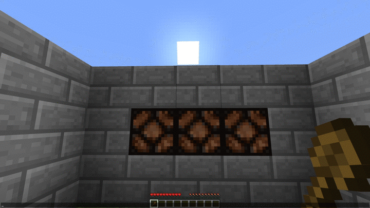

Client and Server side
## MC- Operate

https://user-images.githubusercontent.com/1879846/192179822-46a1e5cb-0a0f-4bb2-aa3e-3f434923aa9a.mp4

#### Features:
- Dispensers can use gunpowder
- Adds Obsidian Dispenser (can use more gunpowder)
- Adds Block Placer
- Adds Placable Gunpowder
- Spoon  
  can turn on lamps (or other blocks that can be lit)
- Adds Auto Crafter
- Computer
- Color Cables
- Item Pipes
- Item Cylinders
- ...in future, if i'm not lazy

